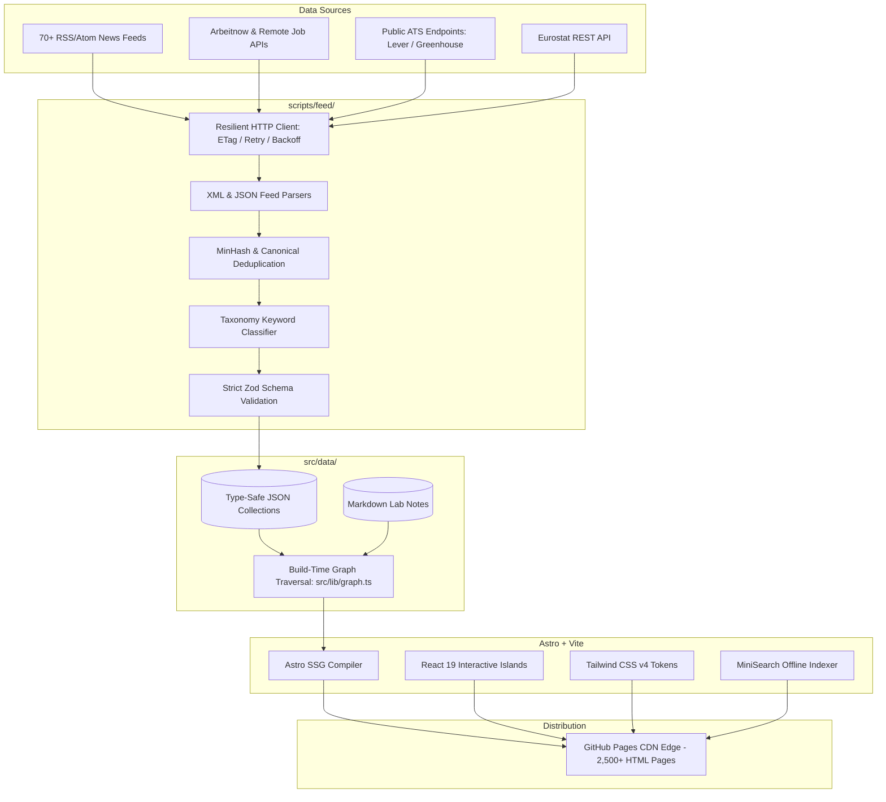

# 🇪🇺 EuroPulse

<div align="center">

[](https://astro.build/)
[](https://react.dev/)
[](https://tailwindcss.com/)
[](https://www.typescriptlang.org/)
[](https://github.com/features/actions)
[](https://opensource.org/licenses/MIT)

### **Europe's business news, connected directly to your career.**

An autonomous editorial intelligence and career navigation platform linking European industrial developments, macroeconomic shifts, company moves, and live job opportunities.

[Explore Live Demo](https://harshithavatturi.github.io/europulse/) · [Report Bug](https://github.com/HarshithaVatturi/europulse/issues) · [Request Feature](https://github.com/HarshithaVatturi/europulse/issues)

</div>

---

## 📖 Table of Contents

- [Vision & Value Proposition](#-vision--value-proposition)
- [Key Features](#-key-features)
- [System Architecture](#-system-architecture)
- [Autonomous Data Pipeline](#-autonomous-data-pipeline)
- [Complete Technology Stack](#-complete-technology-stack)
- [Project Directory Structure](#-project-directory-structure)
- [Getting Started](#-getting-started)
  - [Prerequisites](#prerequisites)
  - [Local Installation](#local-installation)
  - [Build & Preview](#build--preview)
  - [Validating Links](#validating-links)
- [Deployment & GitHub Actions](#-deployment--github-actions)
- [Configuration & Customization](#-configuration--customization)
- [Data Privacy, Copyright & Ethics](#-data-privacy-copyright--ethics)
- [License & Acknowledgements](#-license--acknowledgements)

---

## 💡 Vision & Value Proposition

EuroPulse is designed for Master's, MIM, MBA, and engineering students, cross-border job seekers, and young professionals targeting careers across Europe. 

Traditional job boards present listings in a vacuum. EuroPulse bridges the gap between macroeconomic events and actionable career steps through the **Career Impact Trail**:

```
Macro / News Event ──► Company ──► Industry ──► Country ──► Required Skills ──► Target Roles ──► Live Jobs
```

### Core Tenets:
- **100% Static Web Distribution (SSG):** Over 2,500+ static HTML pages pre-rendered via Astro with sub-millisecond edge response times and zero database hosting costs.
- **Privacy by Design:** Zero tracking scripts, zero third-party cookies, and 100% self-hosted typography via Fontsource (GDPR compliant).
- **Autonomous Intelligence:** Scheduled GitHub Actions runners ingest, deduplicate, classify, and validate feeds every 30 minutes.
- **Editorial Broad-sheet Aesthetic:** Financial terminal data density balanced with classic European editorial typography.

---

## ✨ Key Features

| Feature | Description | Route |
| :--- | :--- | :--- |
| **Europe Business Pulse** | Dated daily briefing editions with country briefs (FR, DE, NL, IT, SE), startup rounds, and market trends. | `/pulse/` |
| **Career Impact Trail** | Interactive contextual hop panel embedded in every dispatch mapping events to skills and jobs. | `/news/[slug]/` |
| **Multi-Facet Jobs Explorer** | Real-time URL-synced search across country, industry, experience, degree, and visa sponsorship. | `/jobs/` |
| **Degree Path Explorer** | Interactive career roadmaps for European degrees (MIM, MBA, MSc Robotics, MSc Data Science, etc.). | `/careers/` |
| **Command Palette (⌘K / Ctrl+K)** | Instant offline search with alias detection (e.g., *"chips"* → Semiconductors, *"Robotics jobs in France"*). | Global Modal |
| **Europe Tile Map** | Pure CSS 5×5 geographical grid mapping industrial intensity across 14 European economies. | Homepage & Countries |
| **Live Macro Indicators** | Real GDP growth and harmonized youth unemployment figures fetched directly from the Eurostat API. | `/countries/[slug]/` |
| **Top 250 Company Dossiers** | Curated intelligence on top European employers, hiring sectors, technologies, and internship routes. | `/companies/` |
| **My Lab Research Log** | Developer & research log tracking ongoing engineering experiments, architecture notes, and tools. | `/my-lab/` |

---

## 🏛️ System Architecture

EuroPulse utilizes an **Islands Architecture**. Static content is pre-rendered to pure HTML at build time, while rich interactive elements are hydrated on-demand using lightweight React components.



---

## ⚙️ Autonomous Data Pipeline

The live data pipeline runs automatically via GitHub Actions ([`.github/workflows/daily-pipeline.yml`](.github/workflows/daily-pipeline.yml)):

1. **Extraction:** Concurrently polls 90+ verified European newsrooms, public job boards, and Eurostat datasets.
2. **Hygiene & Resilience:** Uses conditional `ETag` / `If-Modified-Since` caching, 10s request timeouts, and exponential backoff under `EuroPulseBot/1.0`.
3. **Deduplication:** Normalizes URLs and titles, discarding re-syndicated articles and redundant job requisitions.
4. **Classification:** Deterministically matches news and jobs to EuroPulse's validated taxonomy (`countries`, `industries`, `companies`, `skills`, `roles`).
5. **Quality Gate:** Passes data through strict Zod schemas. If valid, changes are committed and pushed directly to `main`, triggering a zero-downtime GitHub Pages build.

---

## 🛠️ Complete Technology Stack

### Frontend & Core Engine
- **[Astro v7.3](https://astro.build/)**: Core framework and static site generator (SSG) outputting deterministic HTML.
- **[React v19.3](https://react.dev/)**: Client-side interactive islands hydrated with `client:idle` and `client:visible`.
- **[TypeScript (Strict)](https://www.typescriptlang.org/)**: Full type safety across components, graph structures, and domain entities.
- **[Tailwind CSS v4.3](https://tailwindcss.com/)**: Modern CSS-first utility framework with custom design tokens (`@theme`).
- **[Lucide React](https://lucide.dev/)**: Clean, consistent interface icons.
- **[Fontsource](https://fontsource.org/)**: Self-hosted web fonts (`Newsreader`, `IBM Plex Sans`, `IBM Plex Mono`).

### Data Layer & Search
- **[Astro Content Collections](https://docs.astro.build/en/guides/content-collections/)**: Type-safe data-as-code repository.
- **[Zod](https://zod.dev/)**: Runtime schema validation for data ingestion and compile-time integrity checks.
- **[MiniSearch](https://lucaong.github.io/minisearch/)**: Fast, client-side, offline-capable search engine with build-time index pre-generation.

### Data Ingestion & Automation
- **Node.js (>=22.12.0)**: Ingestion runner with native support for `--experimental-strip-types`.
- **Eurostat API Integration**: Automated extraction of European GDP growth and unemployment metrics.
- **GitHub Actions**: Fully autonomous scheduled workflows for feed fetching, linting, building, and publishing.

---

## 📁 Project Directory Structure

```text
europulse/
├── .github/workflows/      # Automated CI/CD & scheduled ingestion pipelines
├── docs/                   # Architecture blueprints and technical specifications
├── public/                 # Static assets, manifests, and favicon
├── scripts/                # Data ingestion, Eurostat fetchers, and verification
│   ├── check-links.mjs     # Post-build broken link verification crawler
│   ├── fetch-eurostat.mjs  # Eurostat REST API consumer
│   └── feed/               # Master autonomous ingestion engine
│       ├── lib/            # HTTP client, deduplicator, classifier, RSS parser
│       └── sources/        # News and job board endpoint adapters
├── src/
│   ├── components/
│   │   ├── islands/        # Hydrated React 19 interactive components
│   │   └── ui/             # Pre-rendered zero-JS Astro components
│   ├── config/             # Site configuration, sources registry, and navigation
│   ├── data/               # Authoritative JSON & Markdown content collections
│   ├── layouts/            # Base HTML and article layout templates
│   ├── lib/                # In-memory graph engine, URL helpers, and MiniSearch
│   ├── pages/              # Static file-based routes (2,500+ generated pages)
│   ├── services/           # Decoupled data access layer
│   ├── styles/             # Tailwind CSS v4 design tokens and global styles
│   └── types/              # Domain models and TypeScript contracts
├── astro.config.mjs        # Astro configuration & Vite plugins
├── package.json            # Dependencies and npm scripts
└── tsconfig.json           # Strict TypeScript configuration
```

---

## 🚀 Getting Started

### Prerequisites

- **Node.js**: `v22.12.0` or higher (LTS recommended)
- **Package Manager**: `npm` (v10+)
- **Operating System**: Windows, macOS, or Linux

### Local Installation

1. **Clone the repository:**
   ```bash
   git clone https://github.com/HarshithaVatturi/europulse.git
   cd europulse
   ```

2. **Install dependencies:**
   ```bash
   npm install
   ```

3. **Start the local development server:**
   ```bash
   npm run dev
   ```
   Open `http://localhost:4321/` in your browser.

4. **Verify types and template syntax:**
   ```bash
   npm run check
   ```

---

### Build & Preview

To compile the static production build:

```bash
# Build static site to ./dist
npm run build

# Preview the production output locally
npm run preview
```

### Validating Links

EuroPulse includes an automated link validator that scans all generated HTML files in `./dist`:

```bash
node scripts/check-links.mjs
```

### Testing Sub-Path Deployments

To simulate deployment under a GitHub Pages sub-path (e.g., `https://username.github.io/europulse/`):

```bash
# Windows (PowerShell):
$env:BASE_PATH="/europulse"; npm run build; node scripts/check-links.mjs

# macOS / Linux (Bash):
BASE_PATH="/europulse" npm run build && node scripts/check-links.mjs
```

---

## 🚢 Deployment & GitHub Actions

EuroPulse includes turnkey GitHub Actions workflows:

1. **Publish to GitHub Pages:**
   - Go to your repository **Settings** → **Pages**.
   - Under **Build and deployment** → **Source**, select **GitHub Actions**.
   - Push to `main` to trigger the build and deployment workflow ([`.github/workflows/deploy.yml`](.github/workflows/deploy.yml)).

2. **Optional API Keys for Expanded Ingestion:**
   EuroPulse ingests hundreds of jobs without any API keys. To unlock additional high-volume feeds, add these optional secrets in repository settings (`Settings > Secrets and variables > Actions`):

   | Secret Name | Provider | Purpose |
   | :--- | :--- | :--- |
   | `ADZUNA_APP_ID` & `ADZUNA_APP_KEY` | [Adzuna](https://developer.adzuna.com/) | Live jobs across DE, FR, NL, IT, ES, AT, PL |
   | `FRANCE_TRAVAIL_CLIENT_ID` & `_SECRET` | [France Travail](https://francetravail.io/) | French public and private requisitions |
   | `REED_API_KEY` | [Reed.co.uk](https://www.reed.co.uk/developers/jobseeker) | UK and cross-border European vacancies |
   | `JOOBLE_API_KEY` | [Jooble](https://jooble.org/api/about) | International aggregation across Europe |

> [!NOTE]
> When optional secrets are absent, the build completes with zero errors, and EuroPulse continues ingesting live data from all open feeds.

---

## ⚙️ Configuration & Customization

EuroPulse is designed to be easily white-labeled or personalized. All brand identities, navigation links, and owner bios live in [`src/config/site.ts`](src/config/site.ts):

```typescript
export const siteConfig = {
  name: 'EuroPulse',
  tagline: "Europe's business news, connected to your career.",
  url: 'https://harshithavatturi.github.io',
  basePath: '/europulse',
  owner: {
    name: 'Harshitha Vatturi',
    title: 'Lead Architect & Editor',
    location: 'Europe',
    links: {
      github: 'https://github.com/HarshithaVatturi',
      linkedin: 'https://linkedin.com/in/...',
    },
  },
};
```

---

## ⚖️ Data Privacy, Copyright & Ethics

EuroPulse adheres to European data protection standards and fair-use intellectual property guidelines:

- **No Article Scraping or Mirroring:** We store only headlines and brief excerpts ($\le 200$ characters) with explicit source attribution and direct canonical links to publishers.
- **Strict Compliance for Job Boards:** Closed platforms (LinkedIn, Indeed, StepStone) are **never scraped**. Instead, the interactive `<LinkOutPanel />` dynamically constructs live search queries to route users directly to source platforms.
- **Zero Third-Party Tracking:** No Google Analytics, no tracking pixels, and no third-party cookies.
- **Open Data Integrity:** Macroeconomic datasets are sourced directly from official European Commission (Eurostat) public APIs.

---

## 📄 License & Acknowledgements

- **Source Code:** Copyright © 2026 **Ghowarthan Karunanidhi**. Released under the [MIT License](LICENSE).
- **Data & Fonts:**
  - News headlines and excerpts are property of their respective publishers.
  - Fonts licensed under the SIL Open Font License (`Newsreader`, `IBM Plex Sans`, `IBM Plex Mono`).

---

<div align="center">

Crafted with ❤️ by **Ghowarthan Karunanidhi** for European students, researchers, and international job seekers.

**[Back to Top ↑](#-europulse)**

</div>
